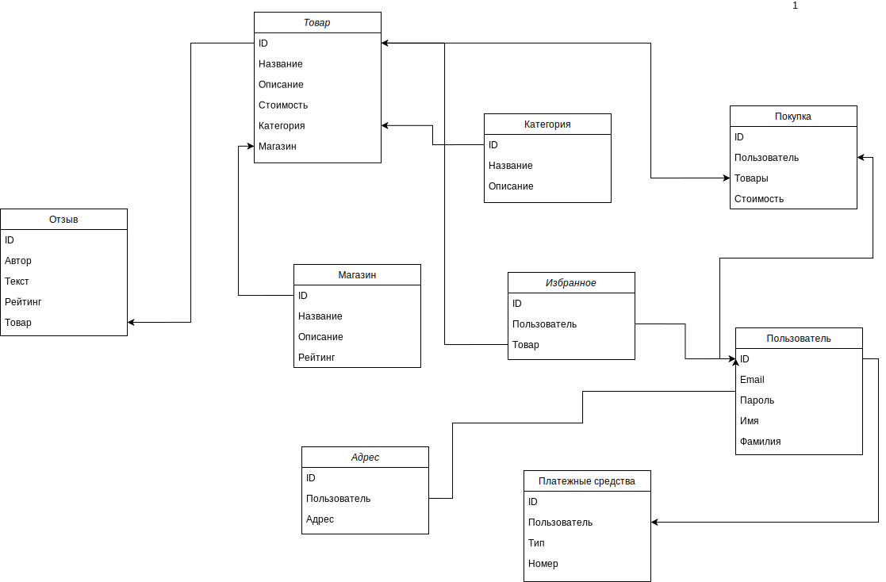
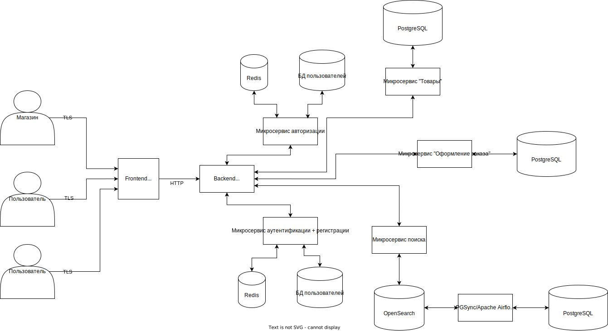

# 1. Тема и целевая аудитория
## AliExpress
### MVP
- Аутентификация
- Авторизация
- Поиск товаров
- Каталог товаров по категориям
- Корзина
- Оформление заказа
- Избранные товары
- Отзывы пользователей
### ЦА
Согласно [[1]](https://www.similarweb.com/ru/website/aliexpress.com/#traffic), рейтинг стран по количеству посетителей:
1. Бразилия, 9.62%
2. Испания, 8.02%
3. Россия, 8.01%
4. США, 7.89%
5. Франция, 6.16%
6. Другие страны, 60.32%
# 2. Расчет нагрузки
Среднее количество посетителей в месяц [[1]](https://www.similarweb.com/ru/website/aliexpress.com/#traffic) - 450 млн.

Количество переходов по странице входа в месяц [[2]](https://www.similarweb.com/ru/website/login.aliexpress.com/#overview) - 61 млн.

Количество поисковых запросов в месяц [[3]](https://www.akm.ru/eng/press/the-monthly-audience-of-aliexpress-russia-has-reached-35-million-people/) - 110+ млн 

AliExpress разлогинивает пользователей при неактивности. Будем считать, что каждый раз, когда пользователь хочет сделать заказ, ему приходится логиниться. При добавлении товара в избранное также необходимо залогиниться. Пусть избранным пользуются 30% посетителей сервиса. 

## Примерный подсчет количества действий
 Тип запроса                | Количество (млн. в день) 
 -------------------------- | ------------------------ 
 Аутентификация             | 2.6
 Поиск товара               | 3.7
 Просмотр каталога товаров  | 0.7
 Добавление в избранное     | 1.2
 Просмотр корзины           | 2.2
 Оформление заказа          | 1.5
 Отзывы пользователей       | 0.4

## Технические метрики

Количество товаров на AliExpress - 100 млн. (на 2020 год) [[4]](https://expandedramblings.com/index.php/aliexpress-statistics-facts/)

Пусть каждый товар в среднем имеет по 5 фотографий и 1 видеоролик. Размер каждой фотографии - 100 КБ (WebP), размер одного видеоролика - 10 МБ (~1 минута, AVC, 1.3 Мбит/c, 720p, звук AAC 128 кбит/c стерео)

У каждого товара есть описание, которое часто сопровождается дополнительными картинками - 20 шт. по 50 КБ (WebP)

Тогда объем хранилища товаров - `(5 * 0.1) + 10 + (20 * 0.05) * (100 * 10^6) = 100000010.5 МБ = 97656 ГБ = 95 ТБ`

Среднее количество фотографий, прикрепленных к отзыву - 5 штук. Каждая по 50 КБ, WebP

Пусть 30% пользователей оставляют подробные отзывы с фотографиями, тогда объем хранилища под отзывы `(100 * 10^6 * 0.3) * (5 * 0.05) = 7500000 МБ = 7324 ГБ = 7.15 ТБ`

Пиковое потребление - удвоенное обычное потребление

## Входящий трафик
Страница результатов поиска каждый раз рендерится на сервере, ленивой подгрузки картинок нет.

Тип запроса    | Объем 1 запроса (КБ) | Суточный объем (ГБ/Сутки) | Пиковое потребление в сутки (Гбит/с)
------------   |----------------------|---------------------------|-------------------------------------
Аутентификация            | 1.2                  | 2.9                       | 0.0006
Поиск                  | 1                    | 3.7                       | 0.0004
Отправка отзыва        | 300                  | 114                       | 0.023
Добавление в избранное | 0.3                  | 0.34                      | 0.00006

## Исходящий трафик
Пусть в корзине находится 1 товар

Тип запроса | Объем 1 запроса (КБ) | Суточный объем (ГБ/Сутки) | Пиковое потребление в сутки (Гбит/с)
------------|----------------------|---------------------------|-------------------------------------
Поиск            | 20000           | 72265                     | 13.5
Просмотр корзины | 2200            | 4726                      | 0.89     
## RPS по типам запросов

Тип запроса            | RPS
------------           | ---
Авторизация            | 30
Поиск                  | 43
Отправка отзыва        | 5
Добавление в избранное | 14
Просмотр корзины       | 26
Оформление заказа      | 18

# 3. Логическая схема БД
Основные сущности: 
- Пользователь
- Товар
- Категория
- Отзыв
- Лайк (избранное)
- Платежное средство
- Магазин
- Покупка

У пользователя может быть привязано несколько способов оплаты, для этого стоит предусмотреть некий enum, в котором будут указаны все возможные варианты.

Пароли пользователя хэшируются с использованием argon2.

Для простоты реализации отзыв представляет из себя обычный HTML, в который можно вставлять разрешенные теги (с использованием WYSIWYG редактора на стороне фронтенда, например [TinyMCE](https://www.tiny.cloud))

# 4. Физическая схема БД
Данные о магазинах, товарах и пользователях - основные данные, с которыми работает разрабатываемая система, потому что из них складывается MVP. Для хранения этих данных выбран PostgreSQL, поскольку эта СУБД активно развивается и используется повсеместно.

Для хранения категорий, отзывов, платежных средств, избранного, списка покупок также используется PostgreSQL

Для поиска товаров используется OpenSearch, open-source аналог ElasticSearch. В OpenSearch периодически загружаются данные из основной СУБД PostgreSQL для более быстрого поиска по товарам и их описаниям (полнотекстовый поиск)

Серверы с данными пользователей, их способов оплаты, заказов и сессий требуется разместить на территории региона, в котором они проживают, поскольку этого могут требовать местные законодательства. 

Данные о сессии на стороне пользователя хранятся в Cookie, на стороне сервера - в Redis. 

## Шардирование по регионам:
- Европа - 1
- Америка - 1
- Азия - 1

Адреса хранятся как строки, поскольку обычно они печатаются на почтовом отправлении и не интерпретируются как геометки.

Самое большое количество rps требуется для поиска (OpenSearch), поэтому можно разместить серверы поисковых движков в указанных выше регионах для увеличения скорости выдачи результатов. 

Для отказоустойчисовти каждой таблицы каждый шард реплицируется в 1 мастер и 2 реплики. В мастер производится запись, чтение происходит из реплики. Если мастер или реплика падает, используется вторая реплика. 

# 5. Выбор технологий
## Frontend
Стек технологий - React, Redux, TypeScript
## Backend
Для большинства задач проекта подойдет Golang. Это компилируемый язык со статической типизацией, большим количеством сторонних библиотек. Единственным недостатком может стать автоматическая сборка мусора.

Возможно разделение проекта на микросервисы:
- Авторизация; 
- Аутентификация + регистрация;
- Товары;
- Оформление заказов;
- Поиск товаров

Связь между микросервисами - gRPC, protobuf

## Веб-сервер + балансировщик
Nginx (или Nginx Plus)
- Проксирует запросы к backend
- Терминирует TLS
- Балансирует нагрузку на backend (round-robin)
- Отдает предварительно сжатую статику
- Сжимает ответы API перед отдачей пользователю (brotli/gzip)
- Кэширует частые get-запросы

## Протоколы взаимодействия
HTTP/2 или HTTP/3, TLS1.3. Сжатие статики и ответов API - brotli + gzip (с использованием предварительного сжатия статики и директив nginx `brotli_static` и `gzip_static`). Формат изображений - WebP. 

## Система управления версиями
- Gitlab (позволяет развернуть свой инстанс)

## CI/CD
- Gitlab CI

## QA
- Автоматический прогон линтеров перед деплоем. Запуск автоматизирован через Gitlab CI

## Мониторинг
- prometheus + grafana

Мониторинг балансировки, rps каждого бэкенда, системной информации (Объем свободного места на диске, графики загрузки оперативной памяти, нагрузки процессора). Отслеживание медленных запросов + отслеживание статусов запросов. График rps 90 перцентиль. 

## Mobile
### iOS
Нативное приложение на Swift
### Android
Нативное приложение на Kotlin

# 6. Схема проекта

### Источники
1. [Similarweb - AliExpress](https://www.similarweb.com/ru/website/aliexpress.com/#traffic)
2. [Similarweb - AliExpress login](https://www.similarweb.com/ru/website/login.aliexpress.com/#overview)
3. [The monthly audience of AliExpress Russia has reached 35 million people](https://www.akm.ru/eng/press/the-monthly-audience-of-aliexpress-russia-has-reached-35-million-people/)
4. [AliExpress statistics and facts](https://expandedramblings.com/index.php/aliexpress-statistics-facts/)
5. [Designing a multi-store e-commerce using frameworks on iOS](https://medium.com/@asteiman/designing-a-multi-store-e-commerce-using-frameworks-on-ios-80f6cc982713)
6. [A Practical Introduction to Elasticsearch](https://www.elastic.co/blog/a-practical-introduction-to-elasticsearch)
7. [PGSync](https://github.com/toluaina/pgsync)
8. [Apache Airflow](https://github.com/apache/airflow)
